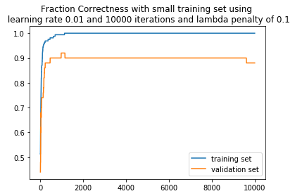
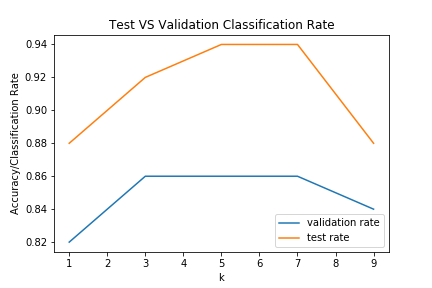

# Logistic-Regression-and-KNN-on-MNIST-digits
* Derived (mathematically) the cross entropy loss function and the L2 regularization model from the likelihood functions.
* Implemented and optimized/tuned hyperameters for both k-NN and (penalized) logistic regression model to classify hand-written MNIST digits of '4's' and '9's'.  
* Plotted visualizations for both models in terms of cross entropy loss and classification error with different hyper-parameters for comparison between models.

## Implementations include:
* `mnist_test.npz, mnist_train.npz, mnist_train_small.npz, mnist_valid.npz` packages for the Julia environment.
* **`Logistic-Regression-and-KNN-on-MNIST-digits.ipynb`** the final jupyter notebook project.

